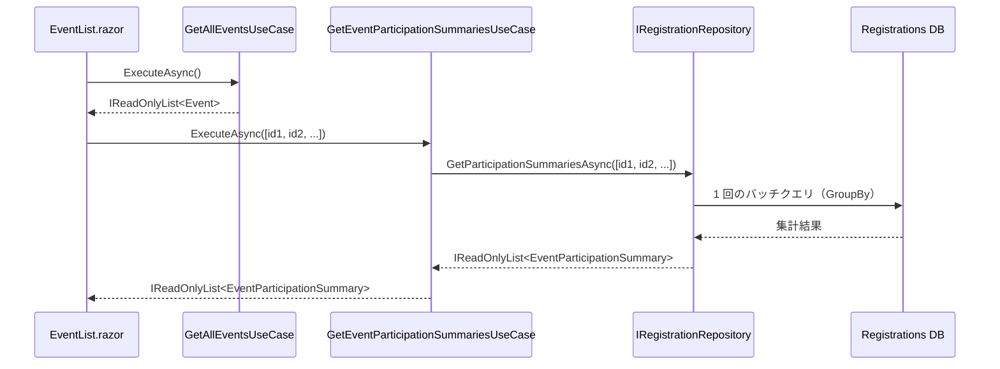

# Registrations モジュール仕様概要

> 対象: イベント参加登録システム — Registrations モジュール
> 関連: [event-registration-system-spec.md](../event-registration-system-spec.md) / [architecture.md](../architecture.md)

---

## 概要

イベントへの参加登録・キャンセル・キャンセル待ち管理を担う Bounded Context。
`EventRegistration.Registrations.Domain` / `.Application` / `.Infrastructure` の 3 レイヤーで構成される。

---

## データ構造

### Registration エンティティ

参加登録情報を表す集約ルート。

| プロパティ | 型 | 必須 | 説明 |
|---|---|---|---|
| `Id` | `Guid` | ✅ | 主キー（自動生成） |
| `EventId` | `Guid` | ✅ | 対象イベントの ID（Events モジュールの Event.Id を参照） |
| `ParticipantName` | `string` | ✅ | 参加者名 |
| `Email` | `string` | ✅ | メールアドレス |
| `Status` | `RegistrationStatus` | ✅ | 登録状態 |
| `RegisteredAt` | `DateTimeOffset` | ✅ | 登録日時 |
| `CancelledAt` | `DateTimeOffset?` | — | キャンセル日時（キャンセル時のみ） |

### RegistrationStatus 列挙型

| 値 | 説明 |
|---|---|
| `Confirmed` | 参加確定（定員以内） |
| `WaitListed` | キャンセル待ち（定員超過） |
| `Cancelled` | キャンセル済み |

### DB 構成

- `RegistrationsDbContext`（Infrastructure 層）に `DbSet<Registration>` を定義
- InMemory DB 名: `"Registrations"`（モジュール単位で一意）
- `EventId` + `Email` の組み合わせでユニーク制約（同一イベントに同じメールアドレスで重複登録を防止）

### EventParticipationSummary DTO

> 対応 Issue: [#1 イベント一覧画面への参加状況表示機能](https://github.com/runceel/202605-visualstudio-githubcopilot-handson/issues/1)

複数イベントの参加状況を一括取得した結果を表す読み取り専用レコード。`EventRegistration.Registrations.Application.DTOs` 名前空間に配置した `sealed record` として実装されている。

```csharp
namespace EventRegistration.Registrations.Application.DTOs;

public sealed record EventParticipationSummary(
    Guid EventId,
    int ConfirmedCount,
    int WaitListedCount
);
```

| プロパティ | 型 | 説明 |
|---|---|---|
| `EventId` | `Guid` | 対象イベントの ID |
| `ConfirmedCount` | `int` | `RegistrationStatus.Confirmed` の件数 |
| `WaitListedCount` | `int` | `RegistrationStatus.WaitListed` の件数 |

> 残り枠数（`max(0, Capacity - ConfirmedCount)`）の算出は呼び出し元（`EventList.razor`）で行う。DTO はカウント値のみを保持し、`Cancelled` 状態の Registration は集計から除外される。

---

## 画面仕様

> Registrations モジュールの画面要素は、イベント詳細画面（`/events/{id}`）内にコンポーネントとして組み込まれる。

### 1. 参加登録フォーム（イベント詳細画面内）

| 項目 | 内容 |
|---|---|
| 表示場所 | イベント詳細画面の一部 |
| 目的 | イベントに参加登録する |

#### 入力フォーム

| フィールド | 型 | バリデーション |
|---|---|---|
| 参加者名 | テキスト | 必須 |
| メールアドレス | テキスト | 必須、メール形式 |

#### 機能

- 入力値のバリデーション
- 定員以内の場合 → ステータスを `Confirmed`（参加確定）で登録
- 定員超過の場合 → ステータスを `WaitListed`（キャンセル待ち）で登録
- 登録結果のフィードバック表示（確定 or キャンセル待ち）

---

### 2. 参加者一覧（イベント詳細画面内）

| 項目 | 内容 |
|---|---|
| 表示場所 | イベント詳細画面の一部 |
| 目的 | イベントの参加者一覧を表示する |

#### 表示内容

- 参加者名
- メールアドレス
- ステータス（確定 / キャンセル待ち）
- 登録日時

#### 機能

- 参加確定者とキャンセル待ち者を区分して表示
- 各参加者にキャンセルボタンを表示

---

### 3. キャンセル機能

| 項目 | 内容 |
|---|---|
| 表示場所 | 参加者一覧の各行 |
| 目的 | 参加登録をキャンセルする |

#### 機能

- キャンセル確認ダイアログの表示
- キャンセル実行後、ステータスを `Cancelled` に更新
- **キャンセル待ち繰り上げ**: 確定者がキャンセルした場合、キャンセル待ちの先頭（`RegisteredAt` が最も古い `WaitListed`）を自動的に `Confirmed` に繰り上げる
- 一覧の即時更新

---

## ビジネスルール

| ルール | 説明 |
|---|---|
| 定員チェック | 現在の `Confirmed` 件数が定員未満なら `Confirmed`、以上なら `WaitListed` |
| 重複登録防止 | 同一イベント × 同一メールアドレスの組み合わせで有効な登録（`Confirmed` or `WaitListed`）が既にある場合は登録不可 |
| キャンセル待ち繰り上げ | `Confirmed` の参加者がキャンセルした場合、`WaitListed` の中で `RegisteredAt` が最も古い登録を `Confirmed` に自動変更 |
| キャンセル後の再登録 | キャンセル済みの参加者は同一メールアドレスで再登録可能 |

---

## モジュール間連携

| 連携先 | 方向 | 内容 |
|---|---|---|
| Events | Registrations → Events | 参加登録時に定員（`Capacity`）を取得して定員チェックを行う |
| Events | Events → Registrations | イベント詳細画面で対象イベントの参加者一覧・登録フォームを表示するためにデータを取得 |
| Events（Web 層） | Web → Registrations | イベント一覧画面で `GetEventParticipationSummariesUseCase` を呼び出し、参加状況サマリーを一括取得する |

---

## ユースケース

Registrations モジュールの Application 層に定義されるユースケース一覧。

### GetEventParticipationSummariesUseCase

> 対応 Issue: [#1 イベント一覧画面への参加状況表示機能](https://github.com/runceel/202605-visualstudio-githubcopilot-handson/issues/1)

複数イベントの参加状況サマリーを一括取得するユースケース。イベント一覧画面での N+1 問題を防ぐために追加した。

| 項目 | 内容 |
|---|---|
| 名前空間 | `EventRegistration.Registrations.Application.UseCases` |
| 責務 | `IRegistrationRepository.GetParticipationSummariesAsync` を呼び出し、複数イベント分の参加状況を 1 回のクエリで一括取得する |
| 入力 | `IEnumerable<Guid> eventIds` — 取得対象のイベント ID リスト |
| 出力 | `Task<IReadOnlyList<EventParticipationSummary>>` |
| 配置ファイル | `DTOs/EventParticipationSummary.cs`、`UseCases/GetEventParticipationSummariesUseCase.cs` |

#### 実際のメソッドシグネチャ

```csharp
public sealed class GetEventParticipationSummariesUseCase(IRegistrationRepository registrationRepository)
{
    public async Task<IReadOnlyList<EventParticipationSummary>> ExecuteAsync(
        IEnumerable<Guid> eventIds,
        CancellationToken cancellationToken = default)
    {
        return await registrationRepository.GetParticipationSummariesAsync(eventIds, cancellationToken);
    }
}
```

#### N+1 問題対策: バッチクエリパターン

イベント一覧画面では複数イベントが表示される。各イベントごとに `CountConfirmedByEventIdAsync` を呼び出すと、N 件のイベントに対して N 回のクエリが発行される（N+1 問題）。これを防ぐため、`GetParticipationSummariesAsync` は複数イベント ID をまとめて受け取り、EF Core の `GroupBy` を使った 1 回のバッチクエリで全イベント分の集計を返す。



**欠損補完**: クエリ結果に含まれない（登録 0 件の）イベントは `ConfirmedCount=0, WaitListedCount=0` として補完する。

---

## リポジトリインターフェース

### IRegistrationRepository 追加メソッド: GetParticipationSummariesAsync

> 対応 Issue: [#1 イベント一覧画面への参加状況表示機能](https://github.com/runceel/202605-visualstudio-githubcopilot-handson/issues/1)

既存の `CountConfirmedByEventIdAsync(Guid eventId)` は単一イベント用。一覧画面でのバッチ取得のために以下のメソッドを追加する。

| 項目 | 内容 |
|---|---|
| メソッド名 | `GetParticipationSummariesAsync` |
| 引数 | `IEnumerable<Guid> eventIds`、`CancellationToken cancellationToken = default` |
| 戻り値 | `Task<IReadOnlyList<EventParticipationSummary>>` |
| 空リスト処理 | `eventIds` が空の場合は DB クエリを発行せず即時空コレクションを返す |
| Cancelled 除外 | `RegistrationStatus.Cancelled` の Registration は集計から除外する |

**Infrastructure 実装**: `RegistrationRepository` にて EF Core `GroupBy` + 欠損補完パターンで実装している（`Registrations.Infrastructure/Persistence/RegistrationRepository.cs`）。

```csharp
public async Task<IReadOnlyList<EventParticipationSummary>> GetParticipationSummariesAsync(
    IEnumerable<Guid> eventIds,
    CancellationToken cancellationToken = default)
{
    var eventIdList = eventIds.ToList();
    if (eventIdList.Count == 0)
    {
        return [];
    }

    var summaries = await dbContext.Registrations
        .Where(r => eventIdList.Contains(r.EventId) && r.Status != RegistrationStatus.Cancelled)
        .GroupBy(r => r.EventId)
        .Select(g => new EventParticipationSummary(
            g.Key,
            g.Count(r => r.Status == RegistrationStatus.Confirmed),
            g.Count(r => r.Status == RegistrationStatus.WaitListed)))
        .ToListAsync(cancellationToken);

    // クエリ結果にない EventId（登録 0 件）は ConfirmedCount=0, WaitListedCount=0 で欠損補完
    var summaryDict = summaries.ToDictionary(s => s.EventId);
    return eventIdList
        .Select(id => summaryDict.TryGetValue(id, out var s)
            ? s
            : new EventParticipationSummary(id, 0, 0))
        .ToList();
}
```

**ポイント:**
- `eventIds` が空の場合は DB クエリを発行せず即時 `[]` を返す（短絡評価）
- `GroupBy(r => r.EventId)` で 1 回のクエリに集約し N+1 問題を回避
- `Status != Cancelled` の条件で Cancelled 件数を除外
- 登録 0 件のイベントはクエリ結果に含まれないため、`eventIdList` を基準に Dictionary 参照で欠損補完する
